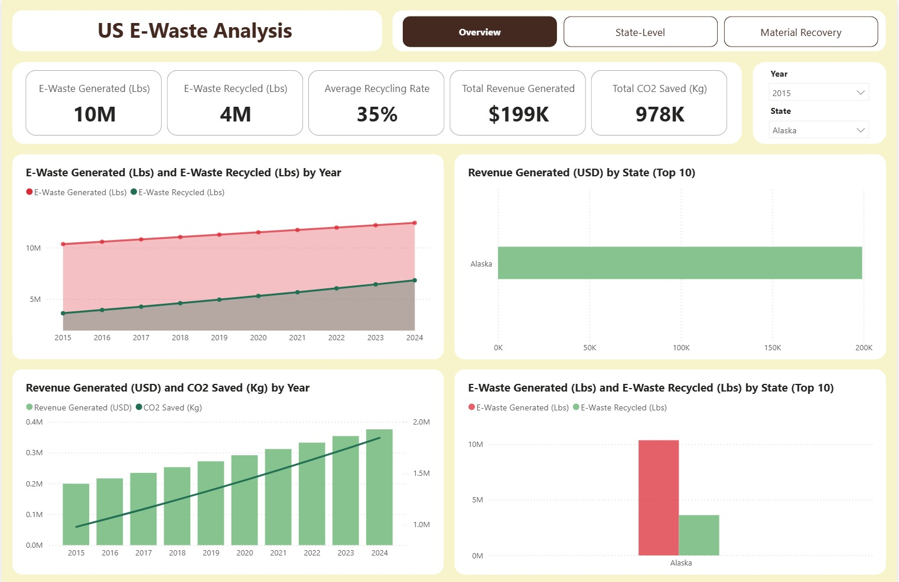
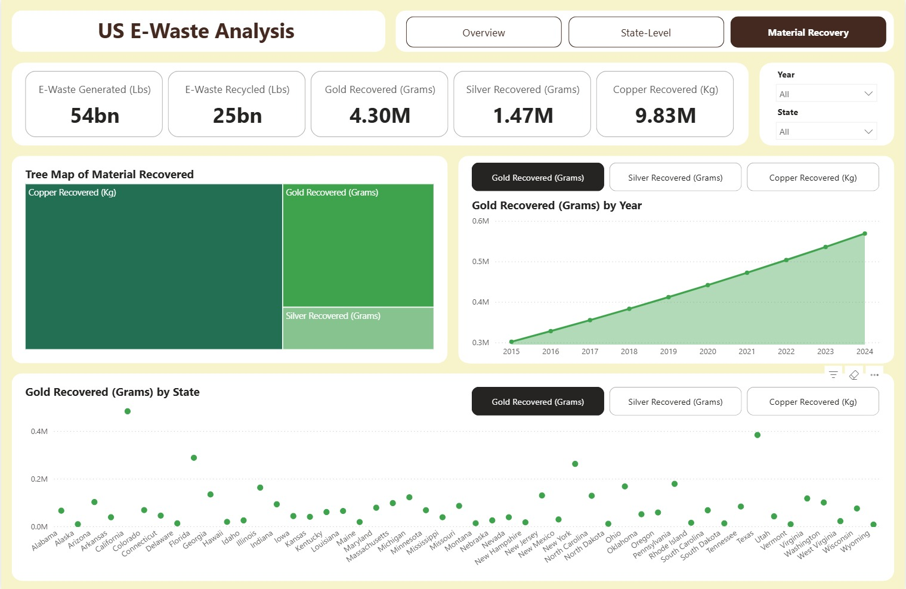

# ♻️ U.S. E-Waste Analytics Dashboard (2015–2024)
### By [Istiaque Mahmud](https://github.com/iamrafat1) | Founder, [ReBin Tech](https://rebintech.com)

This project analyzes **U.S. e-waste generation, recycling performance, and economic impact** using Python and Power BI.  
It aims to support **sustainability innovation** and **data-driven decision-making** for circular-economy initiatives in the United States.

---

## 📊 Overview
The dataset models trends across **50 U.S. states (2015 – 2024)**, evaluating:
- Total e-waste generated vs. recycled  
- CO₂ savings  
- Precious-metal recovery (gold, silver, copper)  
- State-level economic contribution

---

## 🧠 Key Insights
- ♻️ **Recycling Rate:** improved from **35 % → 55 %** (2015 – 2024)  
- 💰 **Cumulative Revenue:**  $1.35 B generated from recovered materials  
- 🌍 **CO₂ Savings:**  6.6 million metric tons (≈ 209 cars off the road per year)  
- 🏆 **Top States:**  California | Texas | Florida | New York | Pennsylvania  
- ⚙️ **Metals Recovered (2015 – 2024):**
  - Gold                        4,301 kg   ($258 M)
  - Copper                     9.8 M kg   ($79 M)
  - Silver                      1,475 kg   ($1.2 M)

---

## 📁 Files Included
| File | Description |
|------|--------------|
| `e_waste_update.ipynb` | Python / Jupyter Notebook – full data analysis & visuals |
| `e_waste.csv` | Cleaned dataset used for analysis |
| `US E-Waste Analysis.pbix` | Power BI interactive dashboard |
| `e_waste_update.pdf` | Printable summary report |
| `Dashboard_overview.jpeg` | Power BI Overview screenshot |
| `metarial over view.jpeg` | Material Recovery dashboard |
| `Gold_Dashboard.jpeg` | Precious Metal Recovery visual |

---

## 🧰 Tools Used
- **Python:**  Pandas | Matplotlib | Seaborn  
- **Power BI:**  Dashboard design & data visualization  
- **Excel / CSV:**  Data preparation and cleaning  
- **GitHub:**  Version control & project showcase  

---

## 📸 Dashboard Preview

### 🔹 Overview Page

### 🔹 Material Recovery Insights

### 🔹 Gold & Precious Metal Analysis

These visuals highlight the relationship between **economic gains** and **environmental benefits**, promoting sustainable e-waste management.

---

## 🚀 Impact & Relevance
This project aligns with:
- **EPA Sustainable Materials Management (SMM)** objectives  
- **Circular Economy principles** for resource recovery  
- **National Interest Waiver (NIW)** focus on environmental sustainability and data analytics innovation  

---

## 📬 Contact
**Istiaque Mahmud (Raf)**  
📧 [istiaquemahmud22@gmail.com](mailto:istiaquemahmud22@gmail.com)  
🌐 [rebintech.com](https://rebintech.com)  
💼 [LinkedIn](https://www.linkedin.com/in/istiaquemahmud)

---

### 🪪 License
MIT License © 2025 Istiaque Mahmud
